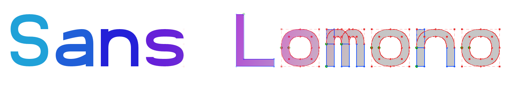
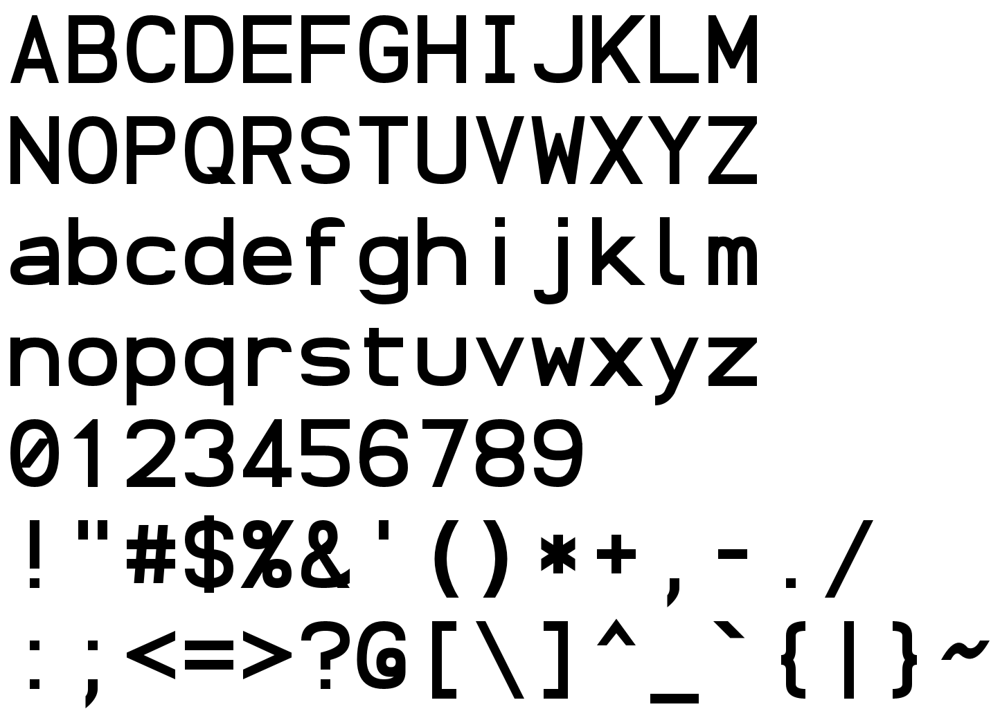
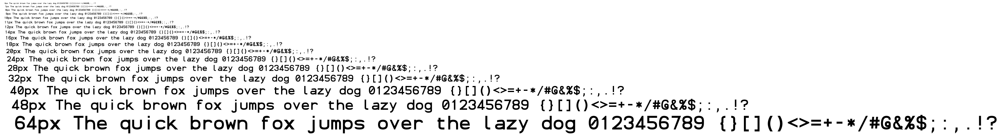
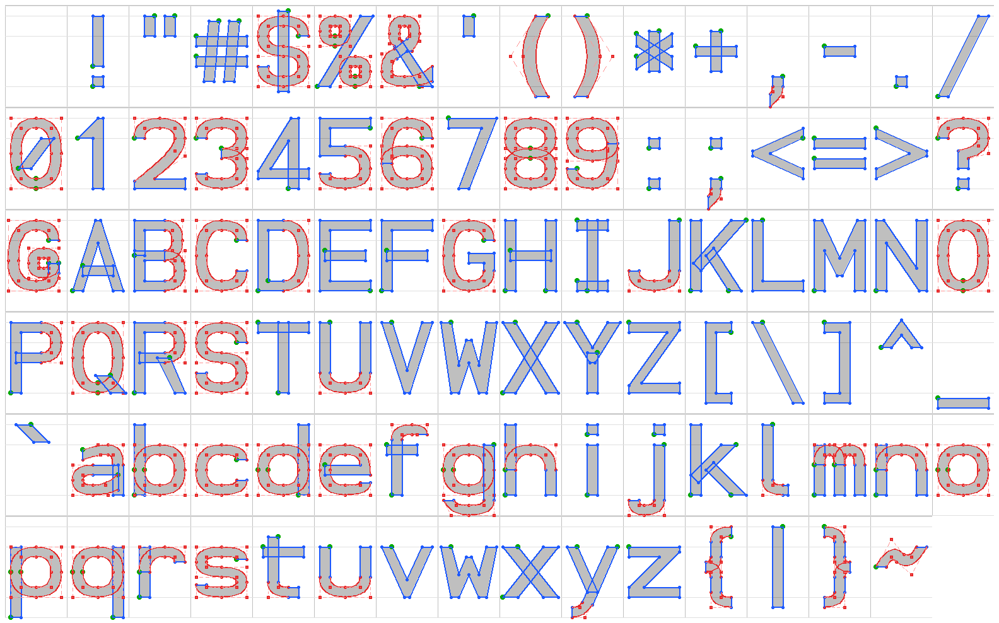
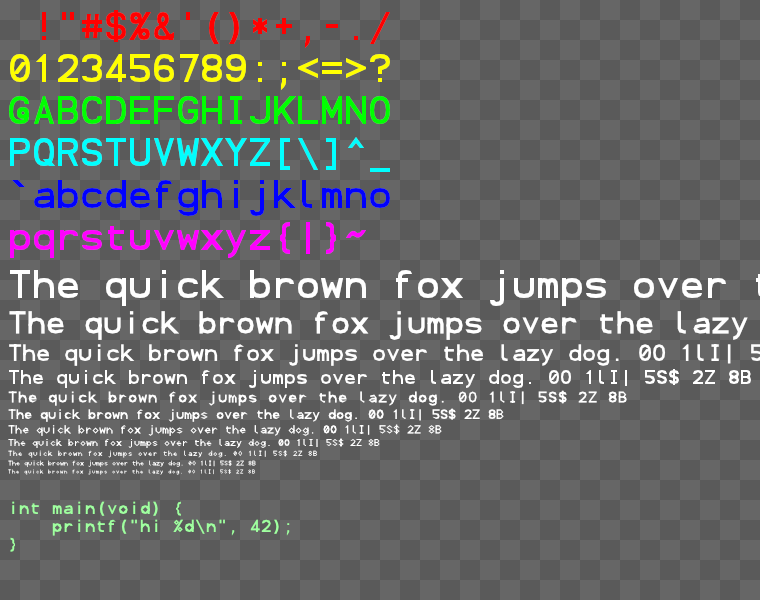

# Sans Lomono

Default URLs: 

* blogpost [https://www.lomont.org/posts/2026/sanslomonofont/](https://www.lomont.org/posts/2026/sanslomonofont/)
* github https://github.com/ChrisLomont/Sans-Lomono.

*A tiny sized (in data needed) sans serif monospaced vector font, useful for gadgets, debuggers, free to use anywhere for any reason.*

Version 1.0, September 2026. Chris Lomont, www.lomont.org.

This is a font and tiny rasterizer by Chris Lomont. The font is sans serif, monospaced, hence Sans Lomono. In France, where my ancestors lived from around 1300 A.D. till the mid 1850s, when they moved to where I live now, "sans lomono" means "without lomono". Lomono has no meaning. Lomont means me.

I designed this font to be extremely minimal in needed data and code size for use in anything. I plan to use it for embedded devices when I need some debug text on graphics programs or LED panels and so on. I wanted it to be decent looking given the tiny footprint, with decent distinction between various coding letters, to avoid confusion. I added the code so I can drop this into anything very easily.

**Sans Lomono** is the font you draw with when the real font system is the thing you are debugging. It is the 95 printable ASCII characters as outlines of lines and quadratic Beziers, monospaced, on a grid of small integers, in**1806 bytes of data** plus a decoder you can read over one coffee. It needs no RAM, no files, no allocator and no opinions about your platform: give it a put-pixel function and it writes text; give it move/line/quad/close callbacks and it hands you outlines for your own rasterizer. Cool technical details are below. For now, it looks like this:



## What is in the box

| file                                                         | what it is                                                   |
| ------------------------------------------------------------ | ------------------------------------------------------------ |
| `sans_lomono.h`                                              | the API, the metrics, and the entire data format, explained in the comments |
| `sans_lomono.c`                                              | the data tables, the outline decoder, and a pixel text writer |
| `demo.c`                                                     | draws the character set in colors, anti-aliased, composited in linear light onto a checkerboard, into a PPM |
| `sans_lomono.json`                                           | the same outlines uncompressed, one SVG-style command list per character |
| `sans_lomono.ttf`                                            | the same outlines as a TrueType font, for editors and browsers |
| `logo.png` `specimen.png` `sizes.png` `sheet.png` `overlay.png` `demo.png` | pictures                                                     |
| `LICENSE.md`                                                 | do anything you want; the author is not liable               |

Two source files, no build system, no dependencies beyond `<stdint.h>`.

## Using it

Pixels, the easy way:

```c
#include "sans_lomono.h"

static void put(void *user, int x, int y, uint32_t rgba)
{
    /* your framebuffer here: rgba >> 24 is coverage 0..255, low 24 bits the color */
}

int x = 10, y = 10;                                  /* top left of the first cell */
lomono_draw_text(&x, &y, 16, "hello, world\nframe 42", put, my_surface, 0x00ff00);
/* x, y now point at the next cell, so keep calling to append */
```

The cell is 16 pixels tall in that example, and `lomono_cell_w(16)` wide. Newlines return to the starting x and move down one cell. Characters the font does not have advance silently. The callback gets the color you passed with the pixel's coverage in the top byte, 0..255, computed exactly: the rasterizer is the integer cover/area scanline technique (the one in FreeType's gray renderer), one pixel row at a time, visiting only the rows and columns a character can reach. Blend that alpha however your surface likes; `demo.c` shows the proper way, in linear light.

Outlines, for people with their own rasterizer:

```c
static const lomono_sink sink = { my_move, my_line, my_quad, my_close };
lomono_glyph('A', &sink, my_path);   /* coordinates in half design units, y up */
```

Fill with the **non-zero winding rule**. Strokes overlap on purpose (the bowl of P sits on its stem, the bar of H on its stems) and non-zero unions them. Even-odd will punch holes where strokes cross, and then you will file a bug, and then I will point at this paragraph. The data shrinks because the decode reuses strokes from one letter to another.

Metrics, in the font's units (half design units):

| line                                              | y    |
| ------------------------------------------------- | ---- |
| cell top                                          | 32   |
| cap height, digits, ascenders, i/j dots, brackets | 28   |
| x-height                                          | 20   |
| baseline                                          | 0    |
| cell bottom, descenders                           | -8   |

Advance is 24, so a cell is 24 by 40 with the baseline 32 below the top. Scale to a cell of H pixels with H / 40. Every character sits exactly on these lines with no overshoot, so text tiles a grid with no surprises.

## The format, in one breath

A character is a bit string. Ops are prefix codes: `0` line, `10` quad, `110` start a contour, `111` copy a shared shape (stems, dots, bars, bowls, the O, the little rings of `%` and `@`) translated to a new position. A
point is one 10-bit number, `x * 39 + y` with offsets, because 24 x-values times 39 y-values is 936 and that fits, so one divide buys a bit per point. Contours close when the next one starts. Padding is zero bits and can never be mistaken for data. The full description, with every number, is in `sans_lomono.h`, because a format that lives in a separate document is a format nobody reads.

Sizes: 1313 bytes of characters, 276 bytes of shared shapes, 217 bytes of offsets. Decoder: 570 bytes of Thumb-2 at `-Oz`; decoder plus the anti-aliased pixel writer, about 2.2 KB (2.9 KB on x86-64). About 2.2 KB of stack while drawing, no heap.

## Legibility



Readable down to about 8 pixel cells, marginal at 6 and 7. Stroke width is 2 of the 40 units, there is no hinting, and physics is undefeated. `0` is slashed, `I` has bars, `l` has a foot, `1` has a flag and `|` is taller than
`I`, so the usual code confusables stay apart:

```
0O 1lI| 5S$ 2Z 8B 6bG 9gq rn/m vv/w cl/d ;: ,. `'" -_~ ij ()[]{} <>= /\ xX cC oO
```

## How it was drawn

Nobody drew outlines. Each character is a few skeleton strokes on an integer grid, and a small stroker inflated them: lines stay lines, quads stay quads, corners get miters or square clips, ends get flat axis-aligned cuts so diagonals land exactly on the metric lines, and the two sides of every stroke snap to the half-unit grid *as a pair* so diagonals keep the same weight as stems. Overlapping strokes were left overlapping for the fill rule to sort out. About 14.7 points per character, 1393 points in all. Design elements were standardized so that the same shape recurs in many characters, which is what the shared shapes in the data exploit. I chose quads over cubics for smaller data (there is some expressive control vs point count variance...), and only allowed one type for a simpler, quicker rasterizer.



`sheet.png` is the whole table with metric guides, `overlay.png` shows the construction (lines blue, quads red with their control points, the first point of each contour green), and `demo.png` is what `demo.c` prints.



## Name

Sans Lomono: it is a sans, it is mono, it is by Lomont, and after this many puns about typography it seemed only fair to commit to one.

## License

Do anything you want with it. See `LICENSE.md`. Every source file carries the same grant, so copies stay free wherever they end up.

